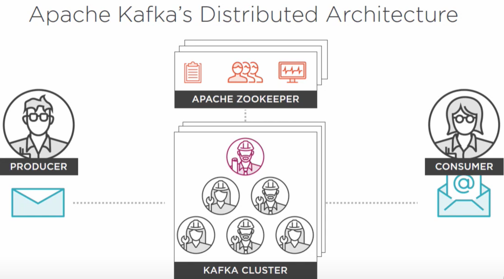

# Kafka

Some example code:
<https://github.com/confluentinc/confluent-kafka-dotnet/tree/master/examples/Web>

What is Kafka
- A high throughput distributed messaging system
- "Distributed Commit Log"
- Essentially a pub-sub system
- Time line
    * Incepted at LinkedIn in 2009
    * First LinkedIn internal deployment in 2010
    * Released open source in 2011
    * 1.1 Trillion messages a day at LinkedIn
    * 2.0 released in 2019
- Named after Franz Kafka
    * Kafkaesque: a nightmarish situation which most people can somehow relate
        to, although strongly surreal.
    * The name is meant to describe the situation they were trying to escape

Zookeeper
- Centralized service for maintaining metadata about a cluster of distributed
    nodes
    * Configuration information
    * Health status
    * Group membership
- Used by Hadoop, HBase, Mesos, Solr, Redis, and Neo4j
- Distributed system consisting of multiple nodes

Topics
- Central Kafka abstraction
- named feed or category of messages
    * Producers produce to a topic
    * Consumers consume from a topic
- Logical entity
- Physically represented as a log

Event Sourcing

Message
- Time stamp: set when a brokers receives the message
- Referenceable identifier
- Binary payload

Offset
- A placeholder
    * Last read message position
    * Maintained by consumers
    * Corresponds to a message identifier

Kafka maintains all messages for 7 days by default

Partitions
- Each topic has 1 or more physical log files called _partitions_
- This is why Kafka can Scale, Fault-Tolerant, and high throughput
- Each partition is maintained on at least one broker (usually more)
- The number of consumers should not exceed the number of partitions. If there
    are more, the extra consumers will not receive any messages.
    
Offset Management
- Auto = enable.auto.commit = true
    * Analogous to garbage collection
- Manual = enable.auto.commit = false
    * commitSync
    * commitAsync

Challenges of Event Driven Architectures EDA
- What is the source of truth?
- How do we deal with duplicate events
- Complexity
- Loss of transactions
- Lineage - events can be lost or corrupted

Reliability Validation
- Reliable Configurations
    * VerifiableProducer
    * VerifiableConsumer
- Test Scenarios
    * Consumer rebalancing
    * Leader re-election
    * [Consumer/Producer/Broker] rolling restart
- Monitoring

Important Metrics:
- Under-replicated Partitions
    * Reported by lead broker
    * Any non-zero value indicates risk of data loss
- Offline Partitions:
    * Partitions with no leader
- Active Controller Count
    * Should always 1
- All Topics Bytes In/Out
- Partition Count
- Leader Count
- Request Metrics
- Producers
    * record-error-rate
    * request-latency-avg
    * outgoing-byte-rate
    * record-send-rate
    * record-rate
    * record-queue-time-avg
- Consumers
    * fetch-latency-avg
    * bytes-consumed-rate
    * records-consumed-rate
    * sync-time-avg
    * sync-rate
    * commit-latency-avg
    * assigned-partitions
    * Lag (github.com/linkedin/Burrow)
